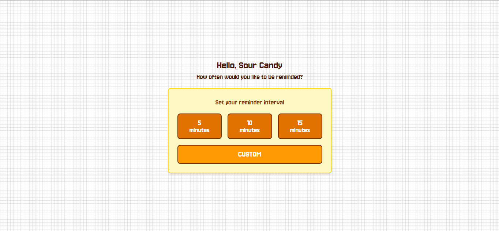

## loop_break

a website that periodically interrupts your hyperfocus with micro-break suggestions to rest your eyes and mind

## Live Demo
[https://shafirahasnaf.github.io/loop_break/](https://shafirahasnaf.github.io/loop_break/)

## Tech Stacks
- HTML5
- TailwindCSS
- Vanilla Javascript

a little story behind this loop_break, i often get hyperfocused while coding and forget to take breaks. so yeah i built this.

this is my first project using TailwindCSS. honestly, the class names felt overwhelming at first (coming from Bootstrap), but i grew to love how much control it gives me over the design!

## Doc

your feedback helps me improve! Whether it's bug reports, feature suggestions or questions about the code. Please use the feedback form or GitHub Issues.

thanks for visiting! 😉
